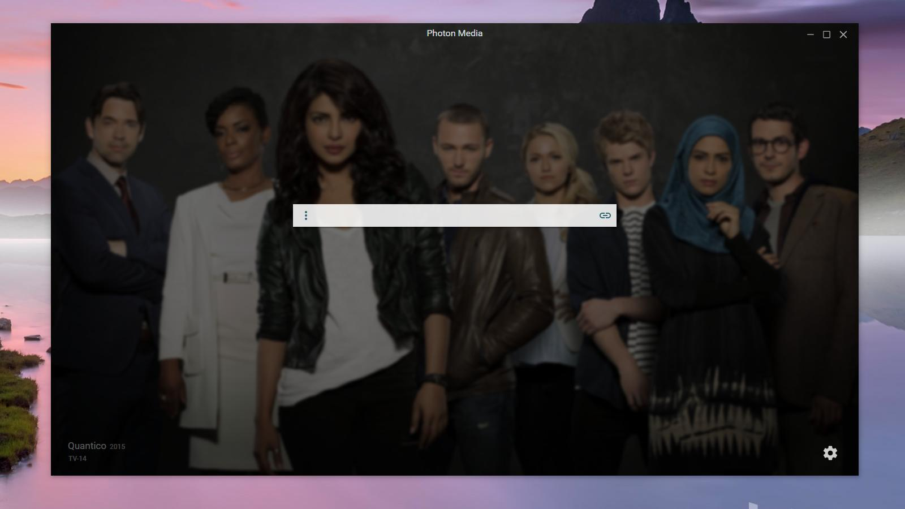

#photon-media

### What is Photon Media?

Photon media was designed to be able to parse any file or URL thrown at it.
  
Photon media will parse, fetch subtitles and offer methods of playback (casting, local players etc) for supported filetypes

### Why did I make it?

I enjoy pretty things.

### Requirements

 - PC running Windows 7 or above.
 - An internet connection

### [WIP] App Screenshots

### Where's the beef!

Pre-built binarys & setup files can be found in the [Releases Tab](https://github.com/luigiplr/photon-media/releases).

 

## Contributing

### Global Requirements

- `bower`
- `gulp-cli`
- `node & npm`

### Getting Started

- `npm install`
- `bower install`

To run the app in development:

- `npm start` or `gulp start-dev`

### Building & Release

- `npm run build`

### Find a bug/issue or simply want to request a new feature?

[Create a Github issue/feature request!](https://github.com/luigiplr/photon-media/issues/new)

## Copyright and License

Code released under the [GPLv3](LICENSE).

