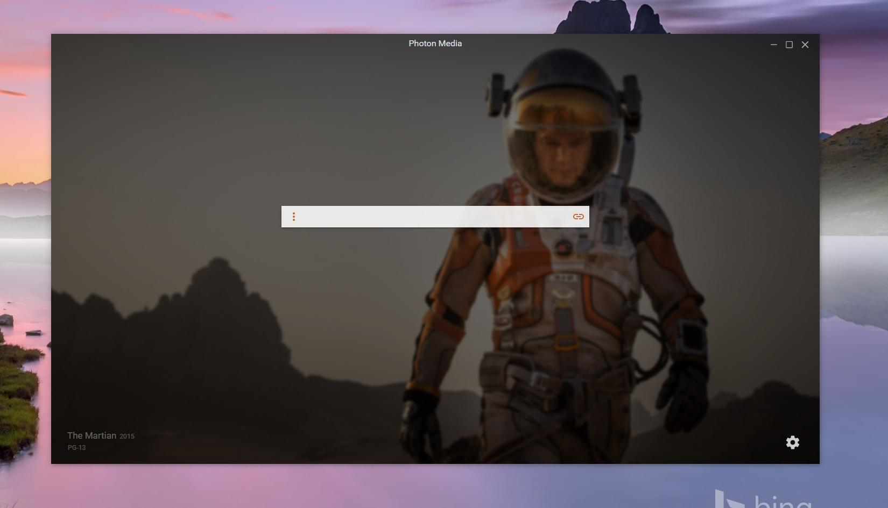
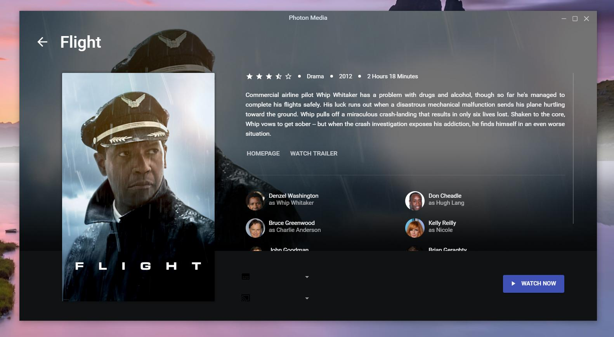
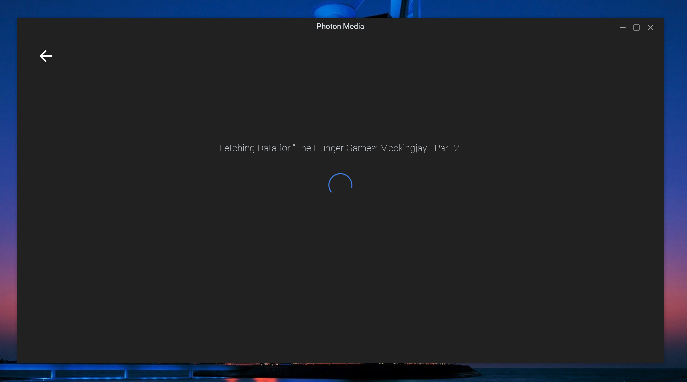
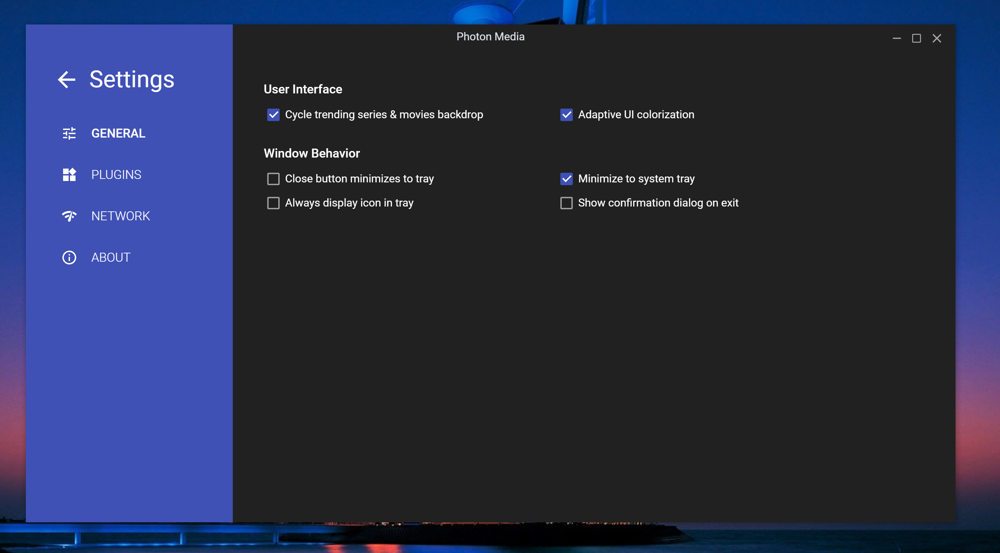
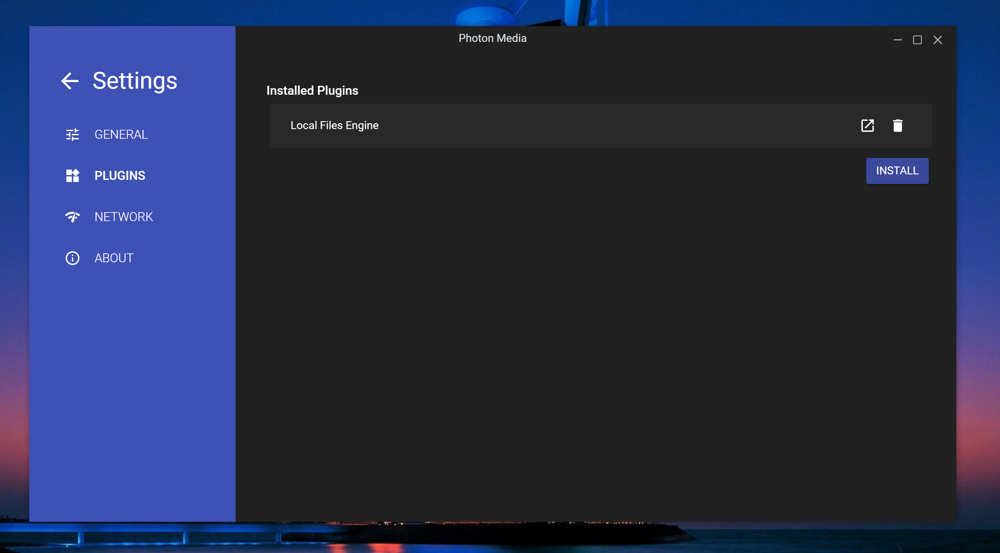

#photon-media

### What is Photon Media?

Photon media was designed to be able to be a general purpose casting application, with the ability for expansion via sting/file engines & new player definition plugins  
Please note its currently in a WIP phase.

### What can Photon stream? 
Out of the box photon will be able to parse local files along with a few common domains (youtube, vimeo etc). 
Photons supported url's can be expanded through the installation of 3rd party engine plugins

### Requirements

 - PC running Windows 7, OS X 10.9, Ubuntu 14.x or above.
 - An internet connection

### [WIP] App Screenshots

 

### Where's the beef!

Pre-built binarys & setup files can be found in the [Releases Tab](https://github.com/luigiplr/photon-media/releases).

 

## Contributing

### Global Requirements

- `bower`
- `gulp-cli`
- `node & npm`

### Getting Started

- `npm install`
- `bower install`

To run the app in development:

- `npm start` or `gulp start-dev` -- On windows terminal must be run as administrator for gulp-dev (symlinks)

### Building & Release

- `npm run build`

### Find a bug/issue or simply want to request a new feature?

[Create a Github issue/feature request!](https://github.com/luigiplr/photon-media/issues/new)

## Copyright and License

Code released under the [GPLv3](LICENSE).

